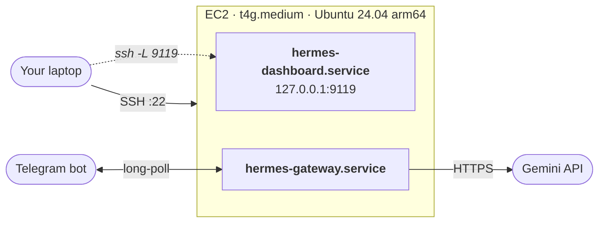

# Hermes Agent on AWS EC2

[](LICENSE)
[](https://www.pulumi.com)
[](https://aws.amazon.com/ec2/)
[](https://hermes-agent.nousresearch.com/)
[](https://aistudio.google.com/)

Provisions Nous Research's [Hermes Agent](https://hermes-agent.nousresearch.com/) on a single ARM EC2 instance. The web dashboard and an optional Telegram bot run as systemd services that start on boot. LLM calls go to Gemini's free tier, so the only recurring cost is the instance (~$27/mo running, $0 stopped).

## Architecture



## Quickstart

> [!NOTE]
> First-boot install (uv, Python 3.11, Node 22, ripgrep, ffmpeg, Hermes) takes 5 to 10 minutes on a `t4g.medium`. `cloud-init status --wait` blocks until it finishes.

```bash
# 1. Auth
pulumi login
aws sso login --profile <yours> && export AWS_PROFILE=<yours>

# 2. Config
npm install
pulumi stack init dev
pulumi config set publicKey "$(cat ~/.ssh/id_ed25519.pub)"
pulumi config set sshCidr   "$(curl -s ifconfig.me)/32"
pulumi config set --secret googleApiKey 'AIza...'   # https://aistudio.google.com/apikey

# 3. Deploy
pulumi up
ssh ubuntu@$(pulumi stack output publicIp) 'cloud-init status --wait'
```

Reach the dashboard from your laptop over an SSH tunnel:

```bash
ssh -L 9119:localhost:9119 ubuntu@$(pulumi stack output publicIp)
# then open http://localhost:9119
```

> [!TIP]
> The dashboard binds to `127.0.0.1` on the instance. It is only reachable through the SSH tunnel. No public web port is exposed.

## Telegram bot (optional)

<details>
<summary><b>Add a Telegram interface</b></summary>

1. In Telegram, message [@BotFather](https://t.me/BotFather): `/newbot`, follow prompts, copy the token.
2. Message [@userinfobot](https://t.me/userinfobot) to get your numeric user ID.
3. Set config and redeploy:
   ```bash
   pulumi config set --secret telegramBotToken '123456789:ABCdef...'
   pulumi config set telegramAllowedUsers '987654321'   # comma-separated for multiple users
   pulumi up
   ssh ubuntu@$(pulumi stack output publicIp) 'cloud-init status --wait'
   ```
4. DM your bot. Hermes replies.

To remove later:
```bash
pulumi config rm telegramBotToken
pulumi config rm telegramAllowedUsers
pulumi up
```

</details>

## Operate

| Action | Command |
|---|---|
| Service status | `ssh ubuntu@$(pulumi stack output publicIp) 'systemctl is-active hermes-dashboard hermes-gateway'` |
| Live-tail the gateway as you chat | `ssh ubuntu@$(pulumi stack output publicIp) 'sudo journalctl -u hermes-gateway -f --no-pager'` |
| Bootstrap log (cloud-init output) | `ssh ubuntu@$(pulumi stack output publicIp) 'sudo tail -50 /var/log/hermes-bootstrap.log'` |
| Tear down everything | `pulumi destroy` |

## Troubleshooting

<details>
<summary><b>Common issues and fixes</b></summary>

| Symptom | Cause | Fix |
|---|---|---|
| `REMOTE HOST IDENTIFICATION HAS CHANGED!` on SSH | EC2 was replaced (user-data change) | `ssh-keygen -R $(pulumi stack output publicIp)` |
| `HTTP 401: Missing Authentication header` in gateway log | Stale `base_url` from default Hermes config still points at OpenRouter | `ssh ... 'hermes config unset model.base_url && sudo systemctl restart hermes-gateway'` |
| `HTTP 429: Resource has been exhausted` | Gemini free-tier rate limit | Wait a minute, or stay on `gemini-2.5-flash` (the default has the most generous free limits) |
| `Primary provider auth failed: Unknown provider 'X'` | `model.provider` is not one Hermes recognizes (`hermes model` shows the list) | Set it back to `gemini` |
| `pulumi up` says it is replacing the instance | Any user-data change forces a replace (intentional) | Wait 5 to 10 minutes for `cloud-init status --wait` after `up` |
| `sudo hermes: command not found` | `hermes` lives in `/home/ubuntu/.local/bin`, not on root's `$PATH` | Use `bash -lc 'hermes ...'` over SSH, or the full path `/home/ubuntu/.hermes/hermes-agent/venv/bin/hermes` |

</details>

## Config reference

| Key | Required | Default | Notes |
|---|---|---|---|
| `aws:region` | no | `us-west-2` | |
| `publicKey` | **yes** |  | Your SSH public key (single line) |
| `sshCidr` | **yes** |  | CIDR allowed to SSH in, e.g. `1.2.3.4/32` |
| `googleApiKey` | **yes** (secret) |  | Google AI Studio API key. Free tier works. |
| `googleModel` | no | `gemini-2.5-flash` | Any Gemini model your key can access |
| `instanceType` | no | `t4g.medium` | Any ARM Graviton type with at least 4 GB RAM |
| `telegramBotToken` | optional (secret) |  | If set, `telegramAllowedUsers` must also be set |
| `telegramAllowedUsers` | optional |  | Comma-separated Telegram numeric user IDs |

## How it's wired

| File | Role |
|---|---|
| [`index.ts`](index.ts) | Entry; reads config, exports outputs |
| [`network.ts`](network.ts) | Security group (SSH from `sshCidr`) |
| [`instance.ts`](instance.ts) | AMI lookup, KeyPair, EC2, Elastic IP |
| [`userdata.ts`](userdata.ts) | Renders the cloud-init bootstrap script |

The LLM side uses Hermes' native `gemini` provider (`GOOGLE_API_KEY` auth, no proxy). Swapping providers is a small change in `userdata.ts`. See the [Hermes provider docs](https://hermes-agent.nousresearch.com/docs/integrations/providers) for the full list.

## License

[MIT](LICENSE) © 2026 Luke Ward
